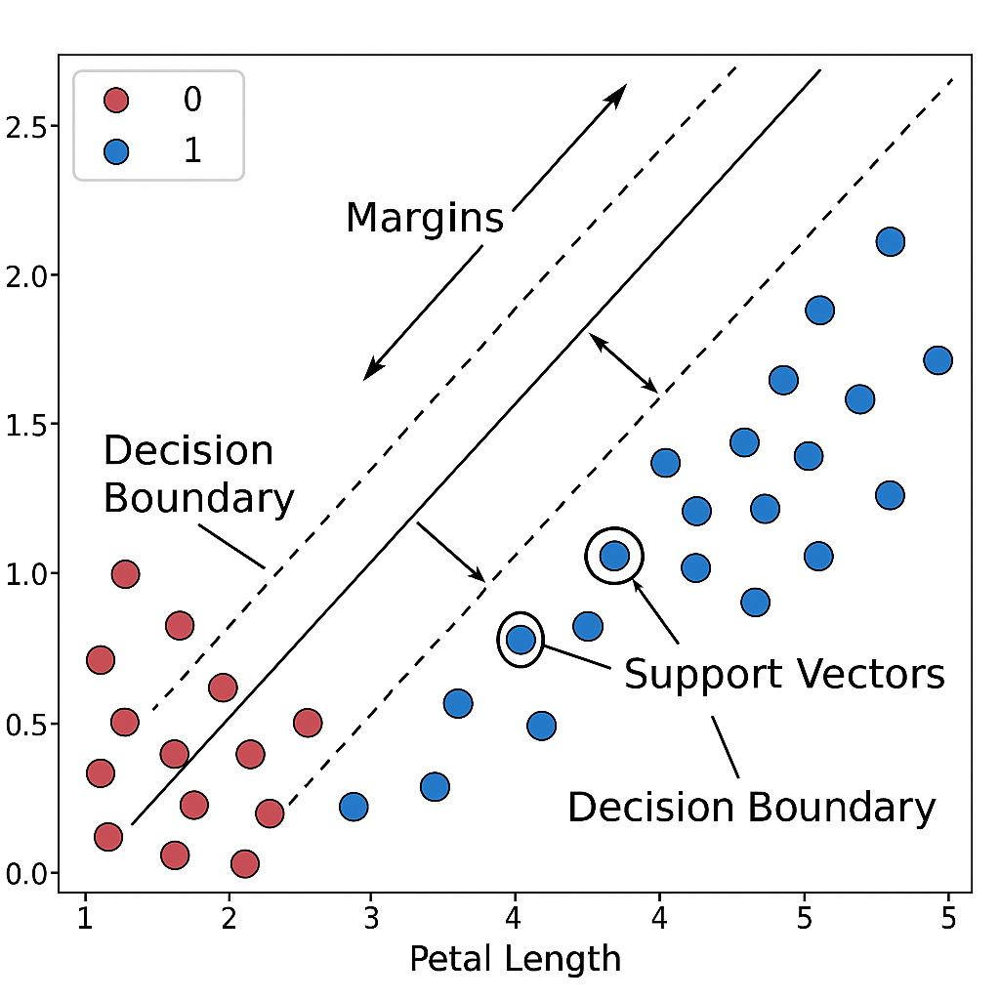

# 支持向量機 Support Vector Machine (SVM)

---

## 原理

一種監督式學習的分類演算法，主要用於二元或多類別的分類問題，目標是找出一條能最清楚區分不同類別的邊界（超平面）  
這條邊界的特性是：

- 兩邊的資料點彼此分隔開

- 與邊界最近的點之間的距離（稱為間隔 margin）最大

這些「距離邊界最近但仍被正確分類」的資料點，稱為支持向量（Support Vectors），這些點對決定分類邊界具有關鍵影響

若資料不是線性可分，SVM會透過**核函數（Kernel Function**將資料映射到更高維度空間，使其在高維空間中變得可分

## 數學概念

- 假設輸入特徵為 𝑥，對應標籤為 𝑦 ∈ {−1,1}

- 我們想找一個分類超平面滿足：

                        𝑤 ⋅ 𝑥 + 𝑏 = 0

    其中 𝑤 是法向量、𝑏 是偏移量

- 目標是最大化邊界距離，等價於最小化：

                        ½ ∣∣w∣∣ ²
 
    並滿足每筆資料：

                        𝑦𝑖 ( 𝑤 ⋅ 𝑥𝑖 + 𝑏 ) ≥ 1

## 優點

1. 效果穩定：在高維資料或樣本數少的情況下表現良好

2. 有理論保證：最大化邊界的做法可降低過擬合的風險  
    (具良好泛化能力：由於最大化邊界距離，不容易過擬合)

3. 可擴充處理非線性問題：透過核函數可應付複雜的資料分布  
    (利用核技巧（Kernel Trick），可以將資料映射到高維空間進行線性分割)

4. 對異常值具有一定容忍力（可調整懲罰參數 C 控制誤差容忍度）

## 缺點

1. 訓練時間較長：當資料筆數很多時，計算效能會大幅下降

2. 參數調整複雜：需要選擇合適的核函數及其參數，否則影響準確率

3. 結果難以解釋：不像決策樹那樣能清楚解釋分類規則

4. 對重疊與雜訊資料較敏感：尤其當資料界線模糊時表現會下降

---

## 舉例 : 分辨兩種花

假設有兩種花：

- 紅花（類別0）：花瓣長度較短、寬度較小

- 藍花（類別1）：花瓣長度較長、寬度較大

把它們畫在一張圖上，X軸是花瓣長度，Y軸是花瓣寬度，會發現這兩類花分布在圖的左右兩側，中間有一段空白區域

SVM 做法：

- 畫出一條分界線，將紅花和藍花分開

- 不只是隨便畫一條線，而是畫出那一條離兩邊最近花朵最遠的線，也就是讓分隔邊界的「安全距離」最大

- 而那些「最接近邊界的花」就叫做支持向量（Support Vectors），這些點是分類結果最重要的關鍵



### 圖中元素說明

藍色與紅色點

- 紅色點代表類別 0（例如：紅花）

- 藍色點代表類別 1（例如：藍花）

圈起的點（Support Vectors）

- 這些是「距離決策邊界最近的點」

- 它們會貼在線的邊界上，並且直接決定分類線的位置

- 即使其他資料點改變，只要支持向量沒變，分類結果不會改變太多

中間的虛線（Decision Boundary）

- 這是 SVM 所計算出的最佳分類線

- 它是兩邊支持向量之間的正中間

- 公式上對應  𝑤 ⋅ 𝑥 + 𝑏 = 0

兩側的實線（Margins）

- 上下兩條平行線代表分類邊界（對應  𝑤 ⋅ 𝑥 + 𝑏 = ± 1）

- 中間區域是「安全間隔區」，SVM 會讓這個區域越寬越好

- SVM 的目標就是讓這兩條線之間的距離最大化

雙箭頭（Margin 標示）

顯示 margin 是什麼：就是支持向量到分類邊界的垂直距離

### 結論

```
「這張圖展示了 SVM 的核心概念。中間的虛線是分類邊界，而兩邊的實線是我們要最大化的間隔。支持向量是最接近邊界的資料點，它們決定了這條線的位置。SVM 的目標不是只要分對，而是要分得穩，讓邊界與資料有最大的安全距離。」
```